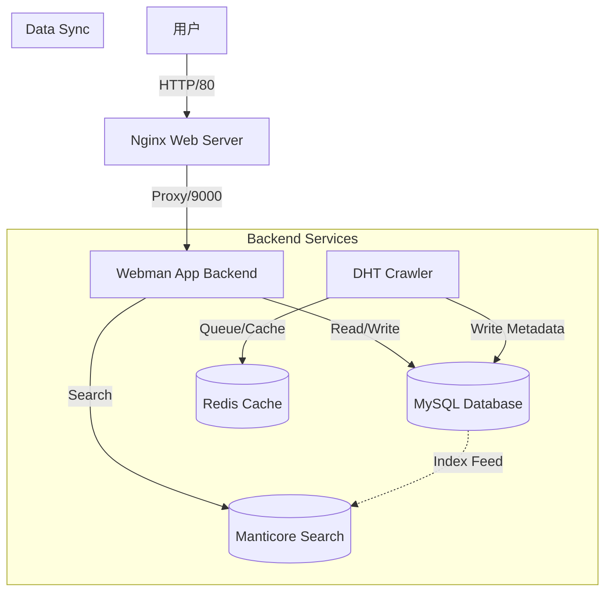

# 架构设计文档

## 1. 系统概览
本系统是一个高性能的分布式 DHT 磁力搜索引擎，旨在通过 DHT 网络实时抓取磁力链接元数据，提供极速的全文检索服务。系统采用微服务架构，基于 Docker 容器化部署。

## 2. 技术栈
- **前端/Web 层**: Nginx + 原生 HTML/Tailwind CSS
  - 负责静态资源服务及反向代理。
  - 页面由后端 Webman 框架服务端渲染 (SSR)。
- **后端服务**: PHP (Webman 框架)
  - **App 服务**: 处理 HTTP 请求，提供搜索 API 和页面渲染。
  - **Crawler 服务**: 运行 DHT 爬虫节点，持续抓取网络上的磁力元数据。
- **数据存储**:
  - **MySQL**: 主数据库，存储种子元数据 (`torrents`)、节点信息 (`torrent_peers`) 及爬虫队列 (`crawl_queue`)。
  - **Redis**: 高速缓存及队列，用于爬虫任务调度去重及元数据临时缓存。
  - **Manticore Search**: 全文检索引擎，提供毫秒级的中文分词搜索能力。

## 3. 架构图

## 4. 核心流程
1. **数据采集**: Crawler 服务加入 DHT 网络，监听并抓取 infohash 及其元数据。
2. **数据入库**: 抓取到的数据经过清洗后存入 MySQL，并同步写入 Manticore 实时索引。
3. **搜索请求**: 用户发起搜索，App 服务请求 Manticore 获取匹配的 infohash 列表。
4. **结果展示**: App 服务根据 infohash 从 MySQL 如果有缓存则直接返回，否则查询详细信息渲染页面。
